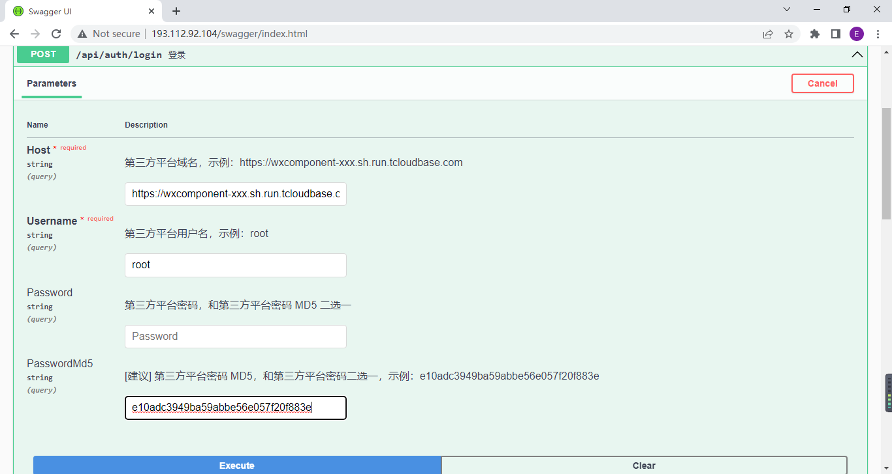

# wx3rd-api
微信第三方平台 API，基于 `服务商微管家` 和 `第三方平台接口` 实现对微信小程序的管理。

## 在线体验

- 地址

<http://193.112.92.104/swagger/index.html>


- 登录

由于需要调用 `服务商微管家` 的接口，因此需要调用登录接口登录 `服务商微管家`，这里需要提供 `第三方平台域名`、`第三方平台用户名`、`第三方平台密码`、`[建议] 第三方平台密码 MD5`



## 部署

部署只依赖 `docker`，需要先安装 `docker`

- 单步执行

``` bash
bash build.sh
bash pack.sh
bash run.sh
```

- 一键部署

``` bash
bash all_in_one.sh
```

## 功能列表

### [服务商微管家] Token 管理

- Token 管理

  ✔ 获取 component_access_token

  ✔ 获取 authorizer_access_token

### [服务商微管家] 代开发小程序管理

- 代开发小程序管理

  ✔ 获取代开发小程序列表

### [第三方平台] 第三方平台管理

- 模板库管理

  ✔ 获取草稿箱列表

  ✔ 将草稿添加到模板库

  ✔ 获取模板列表

  ✔ 删除代码模板

- 域名管理

  ⏳ 设置/获取第三方平台服务器域名

  ✔ 获取第三方平台业务域名校验文件

  ⏳ 设置/获取第三方平台业务域名

### [第三方平台] 代商家注册小程序

- 注册企业小程序

  ✔ 快速注册企业小程序

- 注册个人小程序

  ❌ 快速注册个人小程序

### [第三方平台] 代商家管理小程序

- 基础信息管理

  ✔ 获取基本信息
  
  ❌ 小程序名称检测

- 小程序域名管理

  ❌ 配置小程序服务器域名

  ❌ 配置小程序业务域名

  ❌ 快速配置小程序服务器域名

  ❌ 获取业务域名校验文件

  ❌ 快速配置小程序业务域名

  ✔ 获取发布后生效服务器域名列表

  ✔ 获取发布后生效业务域名列表


## 技术支持

`服务商微管家` 二次开发，DevOps 等

邮箱：2606563537@qq.com
