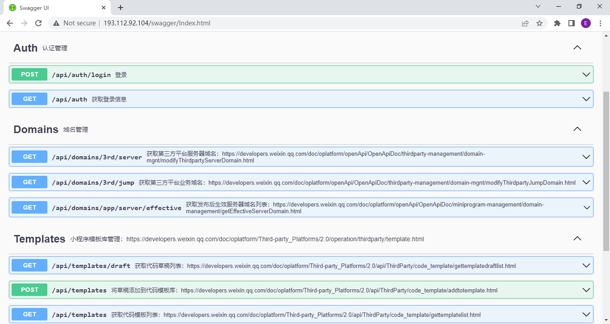
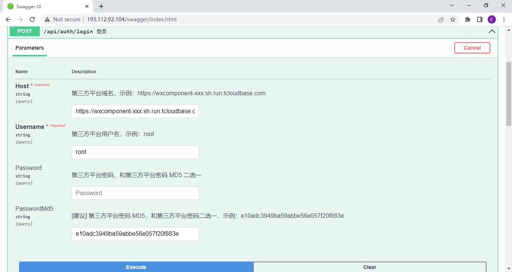

# wx3rd-api
微信第三方平台 API，基于 `服务商微管家` 和 `第三方平台接口` 实现对微信小程序的管理。

## 在线体验

- 地址

<http://193.112.92.104/swagger/index.html>

- 登录

由于需要调用 `服务商微管家` 的接口，因此需要调用登录接口登录 `服务商微管家`，这里需要提供 `第三方平台域名`、`第三方平台用户名`、`第三方平台密码`、`[建议] 第三方平台密码 MD5`

